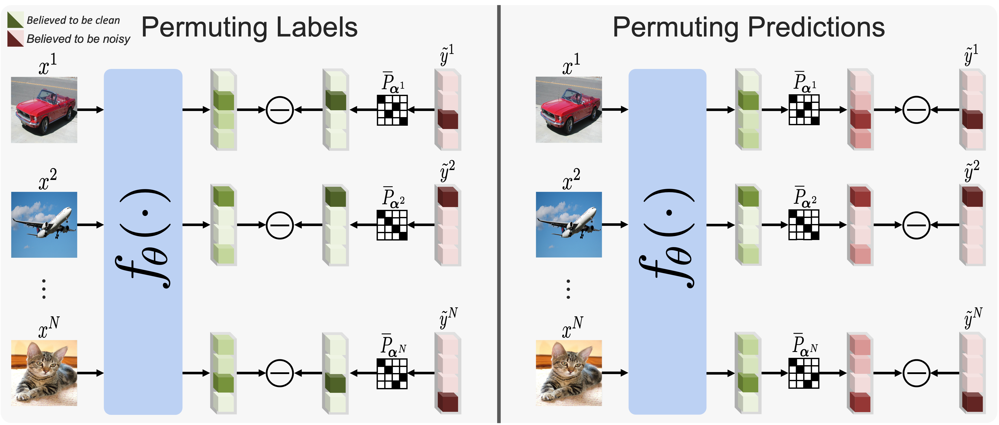

# On Robust Learning from Noisy Labels: A Permutation Layer Approach

This repository is the official implementation of [On Robust Learning from Noisy Labels: A Permutation Layer Approach](). 



## Requirements and Setup

```setup
git clone https://github.com/MohammedAlkhrashi/PermLL.git
pip install -r requirements.txt
cd PermLL
```

## Run Symmetric Noise CIFAR-10
```train
python main.py --noise=0.6 --dataset=cifar10 --init_max_prob=0.35 --milestones=80,100 --model_name=resnet34 --networks_lr=0.02 --permutation_lr=1.5 --weight_decay=0.0005 --noise_mode=sym
```

## Run Asymmetric Noise CIFAR-10
```train
python main.py --noise=0.2 --dataset=cifar10 --init_max_prob=0.35 --milestones=80,100 --model_name=resnet34 --networks_lr=0.02 --permutation_lr=1.5 --weight_decay=0.0005 --noise_mode=asym --with_sampler t
```

## Run Symmetric Noise CIFAR-100
```train
python main.py --noise=0.6 --dataset=cifar100 --init_max_prob=0.225 --milestones=100 --model_name=resnet34 --networks_lr=0.02 --permutation_lr=3 --weight_decay=0.001 --noise_mode=sym
```
## Run Asymmetric Noise CIFAR-100
```train
python main.py --noise=0.2 --dataset=cifar100 --init_max_prob=0.225 --milestones=100 --model_name=resnet34 --networks_lr=0.02 --permutation_lr=6 --weight_decay=0.001 --noise_mode=asym
```


## Run on Clothing1M
```train
python main.py --batch_size=64 --dataset=cloth --epochs=15 --gamma=0.1 --init_max_prob=0.275 --milestones=5,10,13 --model_name=resnet50 networks_lr=0.001 --permutation_lr=80 --warmup=500 --weight_decay=0.001 --with_sampler=t --reweight_sampler=t
```
